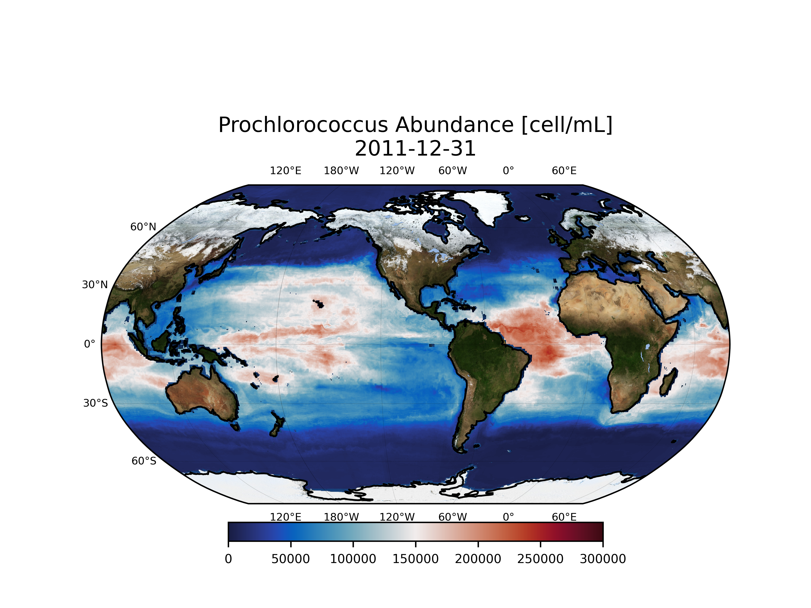
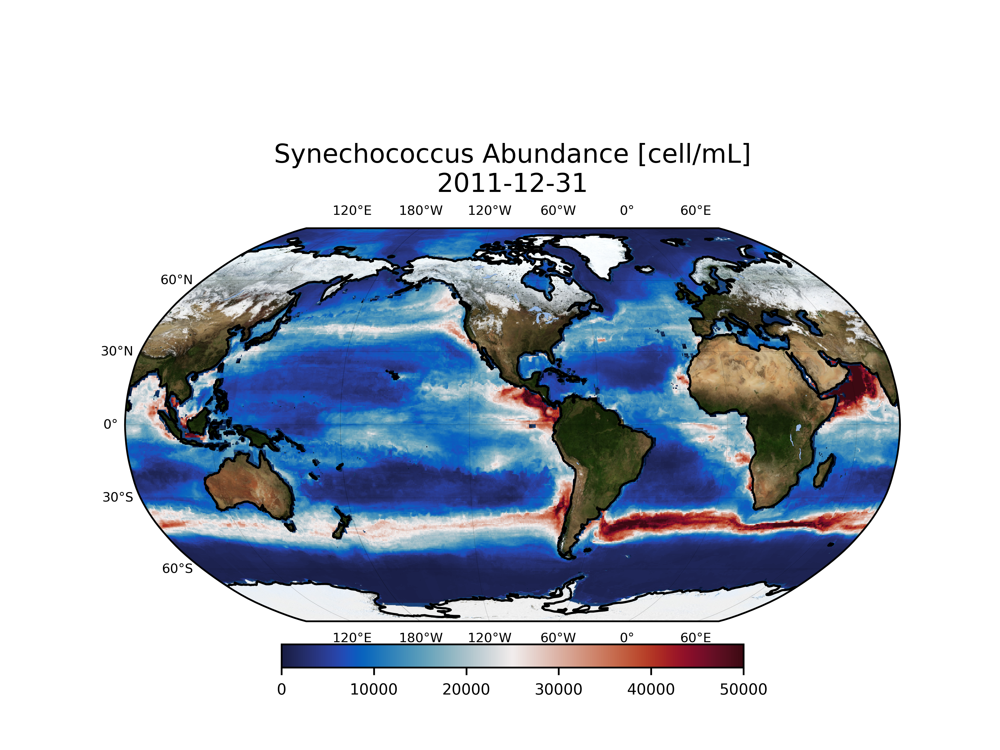

# Marine Microbe Model 

## Spatial Distributions of Prochlorococcus, Synechococcus,  Picoeukaryotes, and Heterotrophic Bacteria Abundances Estimated by Machine Learning Algorithms

The planet's oceans are teeming with diverse microbial communities that drive the biogeochemical processes delineating the global life cycles. Marine phytoplankton account for approximately 50%  of Earth's oxygen through photosynthesis therefore have a critical impact on cycles of nutrients and organic matters, and the overall environment and climate. 

This project compiles 4 decades of direct measurements of marine phytoplankton abundances at global scale, ranging from ocean surface to ~5900 m deep, with over 428,000 discrete samples.
</br>
</br>


</br>
</br>

All measurements are then augmented with a large number of contemporaneous environmental parameters such as temperature, salinity, nutrients, etc. Once data is processed, the ML model uses the environmental parameters (or a transformed version of them) to predict the organism abundances. Below, is an example of the model predictions for global distribution of Prochlorococcus. Model-generated video time series for an 8-year period can be found at:

*  https://github.com/mdashkezari/microML/tree/main/media
* https://threequarters.org/ml

</br>
</br>





## Installation:
```
conda create -n mml python=3.11
conda activate mml
conda install -c conda-forge gdal
# cd to where pyproject.toml is
pip install -e .  

# copy untrack/assets/natural_earth to cartopy maps dirs
```

## Usage:
```
$ cd microML
$ pip install -e .
$ cd microML
$ python main.py 
```


**Note:** 
The data files are not included in the repository due their size. Please send me an email if you are interested.

